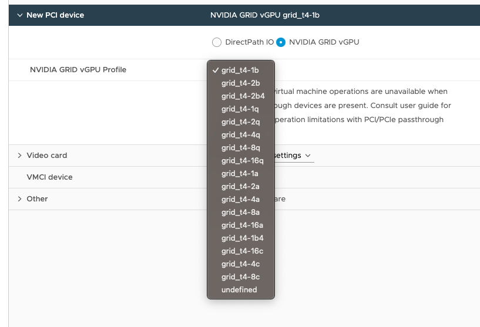
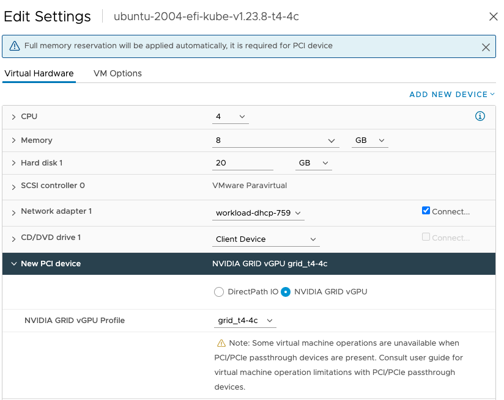
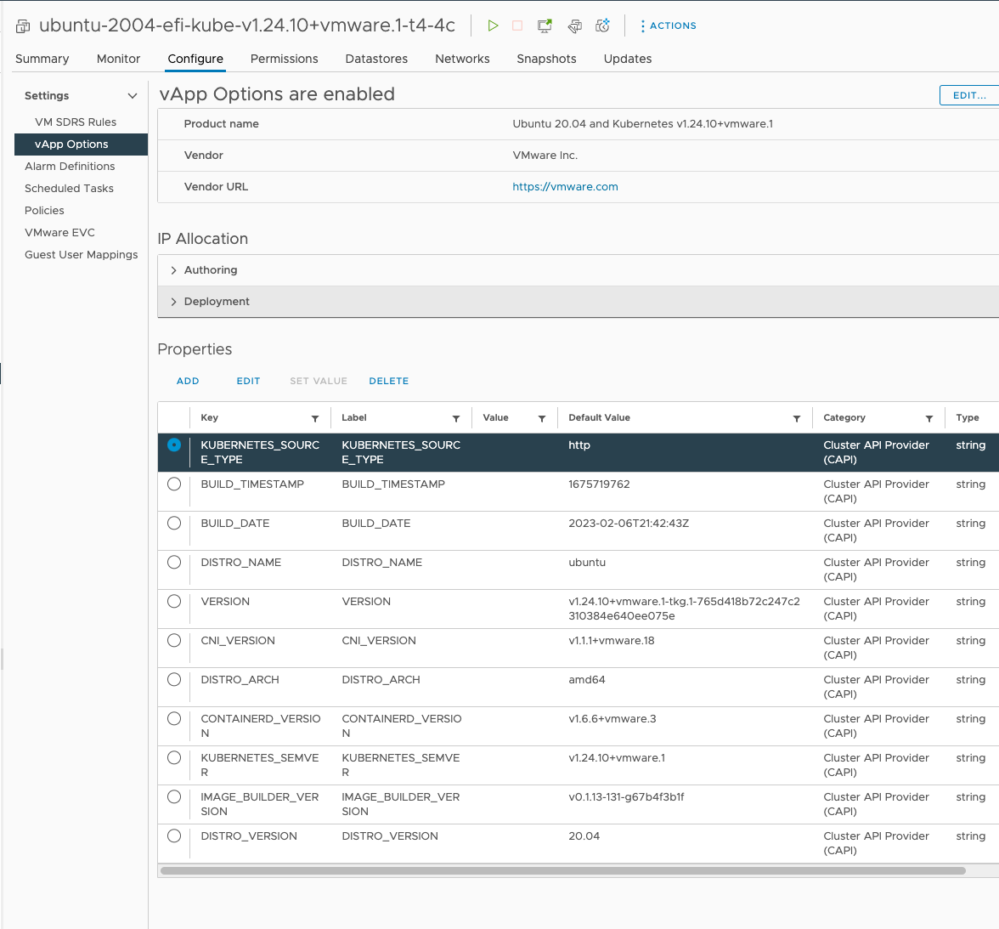
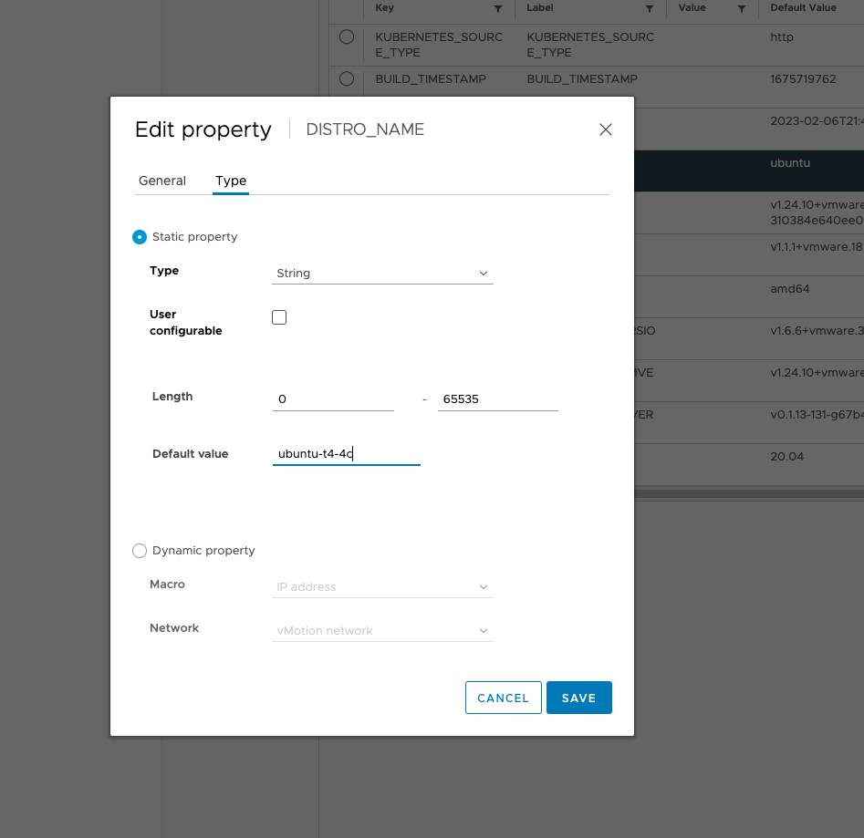
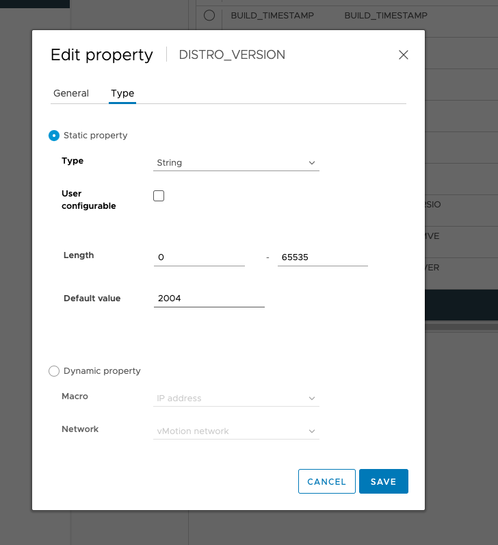
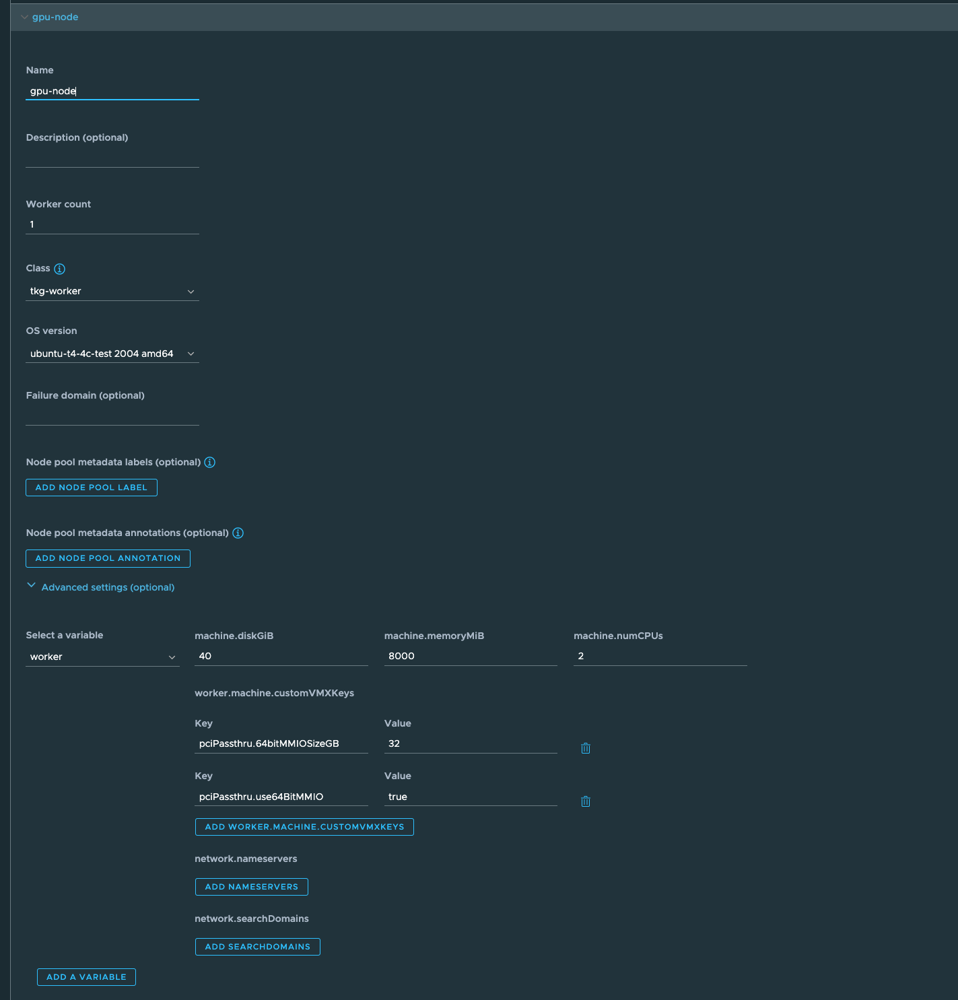

# vGPU with TKGm

This doc outlines a process for using NVIDIA vGPU capabilties with TKGm(TKG w/standalone management cluster). There are two ways of using VGPU capabilties, multi instance and time slicing. This doc will cover both.


## Install ESX Drivers for NVAIE

Follow the NVIDIA docs to install the NVAIE drivers. There is nothing unique to TKG about this process.

Ensure that the version you install aligns with the version of the operator you will be using in the steps further down.

1. Install the VIBs - [docs here](https://docs.nvidia.com/ai-enterprise/latest/quick-start-guide/index.html#installing-grid-vgpu-manager-vmware-vsphere)
2. Disable ECC if your GPU does not support it - [docs here](https://docs.nvidia.com/ai-enterprise/latest/quick-start-guide/index.html#disabling-enabling-ecc-memory)
3. If your GPU supports MIG and you want to use it, it needs to be enabled at the esx level. - [docs here](https://docs.nvidia.com/datacenter/tesla/mig-user-guide/#enable-mig-mode)


**NOTES:**
* If you have previsously had this gpu set to passthrough be sure to disable that
* `nvidia-smi -q` is very helpful to get info about ECC


## Configure the graphics settings in vCenter

In this case we do not want to enable passthrough we just want to enable the "shared direct" settings

1. navigate to the different tabs and set the gaprhics setting to "shared direct" -  [docs here](https://docs.nvidia.com/ai-enterprise/latest/quick-start-guide/index.html#changing-default-gpu-mode-vmware-vsphere)


## Setup vGPU profile based TKG templates

Becuase CAPV does not support vGPU today we need to work around this by creating some vSphere templates that already have the gpu profiles added as pci devices. CAPv support passthrough for GPU by adding a pci device, however the way that adding a vGPU works in vCenter has a slightly different api so this can't be done thropugh CAPv today.


**If you are running TKG 1.x you will first need to create an EFI ubuntu image [using BYOI](https://docs.vmware.com/en/VMware-Tanzu-Kubernetes-Grid/1.6/vmware-tanzu-kubernetes-grid-16/GUID-build-images-linux.html), when building the image be sure to use the command `build-node-ova-vsphere-ubuntu-2004-efi`. In TKG 2.x EFI templates are shipped with the product so we can just use one of those.**

### Get the list of available profiles

Get a list of the profiles that are available for your GPU.These will differ based on your GPU model. 

1. Convert the template to a VM and place it on the host with a GPU. 
2. Edit the VM settings and add a PCI device.
3. The PCI device section should give you an option for `NVIDIA GRID vGPU` choose that and click the dropdown



4. Take screenshot of this list for the next step. 


**NOTES:**

* You can find out what the different profiles mean through the nvidia docs. For the example above with a T4 the different types of vgpu are [here](https://docs.nvidia.com/grid/10.0/grid-vgpu-user-guide/index.html#vgpu-types-tesla-t4). Since this use case is with TKG for traning workloads we can see on the doc the best profiles for that are the `c` profiles.


### Create vGPU profile templates

This step is how we work around the limitation of CAPv today mentioned above. Since this is for AI workloads we will only create templates for the profiles that meet that type. In the case of this example it will be 16c, 8c, and 4c. If you are using mig, the profiles will look different you can see [this doc](https://docs.nvidia.com/datacenter/tesla/mig-user-guide/#a100-profiles) for details. 

The Process is slightly different  between TKG 1.x and 2.x so use the appropriate section below.


#### TKG 1.6

For each relevant profile take the following steps.

1. Copy the EFI based TKG template to a new template and rename it to something meaninful with the profile name in it. ex. `ubuntu-2004-efi-kube-v1.23.8-t4-4c`
2. Convert the newly created template to a VM and place it on a host that has the GPU available. 
3. Edit the settings on the VM and add the PCI device with the GPU profile that matches the name you gave the template and click ok to exit the settings. 

4. convert the VM back to a template.


#### TKG 2.1

For TKG 2.x we want to create a new TKR and OS image this way we can use the new template without having to create a custom cluster class.

1. Copy the EFI based TKG template to a new template and rename it to something meaninful with the profile name in it. ex. `ubuntu-2004-efi-kube-v1.24.10+vmware.1-t4-4c`
2. Convert the newly created template to a VM and place it on a host that has the GPU available. 
3. Edit the settings on the VM and add the PCI device with the GPU profile that matches the name you gave the template and click ok to exit the settings. 

4.  edit the vApp Options on the VM and change the `DISTRO_NAME` field to have the GPU profile added. ex. `ubuntu-t4-4c`
   
   
5. Also edit the vApp option for `DISTRO_VERSION` and change it to `2004`. removing the `.` , this is really only needed if you plan to use TMC to manage these clusters. 
   
6. Convert the VM back to a template.
7. Create a new OSImage. This example is using the 1.24.10 TKR, if you are using a different one be sure to update appropriately. you can copy an existing `OSImage` and edit that. In the below yaml the fields that were updated from the original that was copied are: `labels.os-name`,`name`,  `spec.os.name`

```yaml
apiVersion: run.tanzu.vmware.com/v1alpha3
kind: OSImage
metadata:
  labels:
    image-type: ova
    os-arch: amd64
    os-name: ubuntu-t4-4c
    os-type: linux
    os-version: "2004"
    ova-version: v1.24.10---vmware.1-tkg.1-765d418b72c247c2310384e640ee075e
    v1: ""
    v1.24: ""
    v1.24.10: ""
    v1.24.10---vmware: ""
    v1.24.10---vmware.1: ""
  name: v1.24.10---vmware.1-tkg.1-gpu-t4-4c
spec:
  image:
    ref:
      version: v1.24.10+vmware.1-tkg.1-765d418b72c247c2310384e640ee075e
    type: ova
  kubernetesVersion: v1.24.10+vmware.1
  os:
    arch: amd64
    name: ubuntu-t4-4c
    type: linux
    version: "2004"
```


7. edit the existing TKR for this version. in this case it is  `v1.24.10---vmware.1-tkg.2` and add the new image to the list of images.

```yaml
osImages:
  - name: v1.24.10---vmware.1-tkg.1-fbb49de6d1bf1f05a1c3711dea8b9330
  - name: v1.24.10---vmware.1-tkg.1-765d418b72c247c2310384e640ee075e
  - name: v1.24.10---vmware.1-tkg.1-226b7a84930e5368c38aa867f998ce33
  - name: v1.24.10---vmware.1-tkg.1-gpu-t4-4c
```


## Create a nodepool with GPU

This is a slightly different process based on which version of TKG you are on and whether or not you are adding a nodepool to an existing cluster. The sections below are broken out by scenario.

### TKG 1.6 - new cluster

This approach makes use of an overlay to be able to add nodepools mainly due to some extra config that is needed that the tanzu cli nodepools command doesn't support today. The overlay and docs are [here](https://github.com/warroyo/tkg-overlays/tree/main/vsphere/nodepools#usage-for-new-clusters) but this will outline the steps as well.

1. Create a new directory on the workstation you use to create TKG clusters. 
   ```
   mkdir -p ~/.config/tanzu/tkg/providers/ytt/03_customizations/nodepools
   ``` 
2. Copy the `nodepools_values.yml` and the `nodepools.yml` from the above linked repo into the new `nodepools` directory. 
3. Create/modify your new cluster yaml file. This should be the file you are passing to the tanzu cli to create the cluster. Official docs for creating a workload cluster config file are [here](https://docs.vmware.com/en/VMware-Tanzu-Kubernetes-Grid/1.6/vmware-tanzu-kubernetes-grid-16/GUID-tanzu-k8s-clusters-index.html#create-a-workload-cluster-configuration-file-1.). You can also find the full workload cluster template [here](https://docs.vmware.com/en/VMware-Tanzu-Kubernetes-Grid/1.6/vmware-tanzu-kubernetes-grid-16/GUID-tanzu-k8s-clusters-vsphere.html).
4. Add the Nodepool settings to the cluster yaml file. Below is an example. The full option set is [here](https://github.com/warroyo/tkg-overlays/blob/main/vsphere/nodepools/cluster_config.yml) anything that is omitted from the `extrapools` settings will be inherited from the main cluster values. The important pieces here are the `template` and the `customVMX`. The `64bitMMIOSizeGB` shoudl be calcuated based off of your GPU size. 
```yaml
EXTRA_NODE_POOLS: true
extrapools: |
  - name: gpu-pool
    replicas: 1
    template: <full path to template we created>
    customVMX: "pciPassthru.use64BitMMIO=true,pciPassthru.64bitMMIOSizeGB=<GIB>"
    labels:
      gpu-workers: 'true' 
    taints: []
```

5. Create a cluster as you typically would. This config above will create a nodepool in the cluster called gpu-pool

```
tanzu create cluster -f <workload-cluster-yaml>
```


6. validate the node pool is created

```bash
tanzu cluster node-pool list <cluster-name>
  NAME      NAMESPACE  PHASE    REPLICAS  READY  UPDATED  UNAVAILABLE  
  gpu-pool  default    Running  1         1      1        0            
  md-0      default    Running  1         1      1        0            
  md-1      default    Running  1         1      1        0            
  md-2      default    Running  1         1      1        0          
```

7. Validate that the gpu nodes attached the right device in vsphere.


### TKG 1.6 - existing cluster

Adding a new node pool is done using the same overlays that are used in the above step for creating a new cluster.

1. Follow steps 1-4 from the section above on creating a new cluster.

2. Change into the TKG mgmt cluster context

3. Run the following command. This command will generate the yaml to create a new cluster but by adding `ADD_POOLS=true` it will only generate the nodepool yaml and apply that to the existing cluster.

```bash
ADD_POOLS=true tanzu cluster create -f <workload-ckluster-yaml> --dry-run | kubectl apply -f-
```

4. validate the node pool is created

```bash
tanzu cluster node-pool list <cluster-name>
  NAME      NAMESPACE  PHASE    REPLICAS  READY  UPDATED  UNAVAILABLE  
  gpu-pool  default    Running  1         1      1        0            
  md-0      default    Running  1         1      1        0            
  md-1      default    Running  1         1      1        0            
  md-2      default    Running  1         1      1        0          
```


### TKG 2.1 - new cluster

TKG 2.x uses cluster class based cluster so the approach to creating a cluster is slightly different. Follow the docs [here](https://docs.vmware.com/en/VMware-Tanzu-Kubernetes-Grid/2.1/using-tkg-21/workload-clusters-configure-vsphere.html#create-an-object-spec-file-3) to generate the initial cluster yaml that we will use. This approach uses the "Object spec file" approach, which just means it's using the k8s reosurces directly instead of directly creating the cluster with the Tanzu cli. The Tanzu cli is still used to generate the object spec.

1. generate the cluster object spec per the docs

```bash
tanzu cluster create my-cluster --file my-cluster-config.yaml --dry-run > my-gpu-spec.yaml
```

2. Edit the generated file and add a nodepool for GPU workers. The below yaml can be added to the `workers` section of the file. Notice that the `resolve-os-image`  annotation is referencing the `os-name` for the new `OSImage` we created in a previous step. this is how the new template that has the gpu attached is resolved. 

```yaml
- class: tkg-worker
  metadata:
    annotations:
      run.tanzu.vmware.com/resolve-os-image: image-type=ova,os-name=ubuntu-t4-4c
  name: gpu-t4-4c
  replicas: 1
  variables:
    overrides:
    - name: worker
      value:
        machine:
          diskGiB: 40
          memoryMiB: 8192  
          numCPUs: 4
          customVMXKeys: 
            pciPassthru.use64BitMMIO: 'true'
            pciPassthru.64bitMMIOSizeGB: '32'
```
3. apply the yaml into the mgmt cluster.
4. validate that the new node-pool is up

```
tanzu cluster node-pool list <cluster-name>
```

### TKG 2.1 - existing cluster

Becuase TKG 2.1 uses cluster class all we need to do to add to an existing cluster is to edit the cluster yaml and add the new worker pool and re-apply. These steps will be the exact same as the above steps for creating a new cluster. 

### TKG 2.1 - TMC

Asumming the steps above to set the vApp DISTRO_VERSION to `2004` was followed you can use TMC to create node pools with gpu. you can do this either when creating the cluster or after the fact.

1. when adding a node pool you should see a new "OS version"  for the OSImage we created. choose that one.
2. also add the custom vmx keys in the advanced options



## Deploy the NVIDIA GPU operator

The GPU operator will be deployed from the [ NVAIE catalog](https://catalog.ngc.nvidia.com/?filters=&orderBy=weightPopularASC&query=). Prior to starting this step make sure you have your [NGC API Token](https://resources.nvidia.com/en-us-nvaie/quick-start-guide-nvaie) to access the private registry.

In this guide we are deploying the `v22.9.1` operator helm chart. This is due to the version alignment between the ESX Drivers and the client drivers that get deployed by the operator. You will need to be sure that you are pulling the right version of the operator and updating the script below according to what your environment needs. 

The script below takes a very standard approach to deploying the helm chart. If you need to modify any values of the chart you will need to pull down the chart values and update the values prior to deploying.

**NOTE lower memory < 8GB tends to be a problem when installing the the gpu operator**

1. export your NGC api token. 

```
export NGC_API_KEY='token-here'
````

2. [Get the client configuration token](https://docs.nvidia.com/ai-enterprise/latest/quick-start-guide/index.html#generating-client-configuration-token-for-cls-instance) from the license server. we will need to create a file called `client_configuration_token.tok` it is very important to name this exactly that. The operator requires this naming. Place this file in the working directory where you will run the below script. This file will be added into a config map by the script.


3. Copy the below content into a file and make it executable

```bash
#!/bin/bash
echo "creating namespace gpu-operator…"
kubectl create namespace gpu-operator

echo "ensuring the empty gridd.conf file exists…"
touch gridd.conf

echo "creating configmap licensing-config …"
kubectl create configmap licensing-config -n gpu-operator --from-file=gridd.conf --from-file=client_configuration_token.tok 

export REGISTRY_SECRET_NAME=ngc-secret
export PRIVATE_REGISTRY=nvcr.io/nvaie

echo "creating ngc-secret…"
kubectl create secret docker-registry ${REGISTRY_SECRET_NAME} \
    --docker-server=${PRIVATE_REGISTRY} \
    --docker-username='$oauthtoken' \
    --docker-password=${NGC_API_KEY} \
    -n gpu-operator


echo "adding the helm repo nvaie…"
helm repo add nvaie https://helm.ngc.nvidia.com/nvaie \
  --username='$oauthtoken' --password=${NGC_API_KEY} \
  && helm repo update


#echo "doing the helm fetch…"

helm fetch  https://helm.ngc.nvidia.com/nvaie/charts/gpu-operator-3-0-v22.9.1.tgz --username='$oauthtoken' --password=${NGC_API_KEY} 


echo "installing GPU operator version"
helm install --wait gpu-operator gpu-operator-3-0-v22.9.1.tgz -n gpu-operator --set driver.repository=nvcr.io/nvaie --set operator.repository=nvcr.io/nvaie --set driver.imagePullPolicy=Always

echo DONE
```

4. Validate that the operator installed. 

```
kubectl get pods -n gpu-operator
```

5. Validate that the driver is licensed

```bash
kubectl exec -it ds/nvidia-driver-daemonset -n gpu-operator -- nvidia-smi -q | grep -i license
Defaulted container "nvidia-driver-ctr" out of: nvidia-driver-ctr, k8s-driver-manager (init)
    vGPU Software Licensed Product
        License Status                    : Licensed (Expiry: 2023-5-17 13:14:18 GMT)
```

**NOTES:**

* To troubleshoot licensing, exec into the driver-daemonset pod and search syslog for `nvidia-gridd`. This will show licensing errors.
* If you are using MIG, make sure that you can see the mig devcies when running `nvidia-smi` when exec'd into the driver-daemonset. 